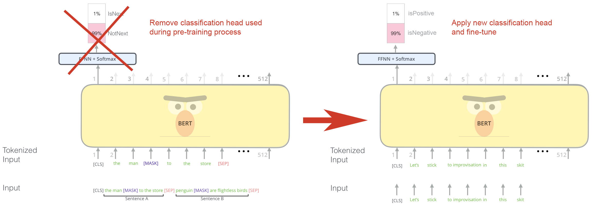

<h1 style="font-size:300%;">AI4EduRes'2023: <br />Fine-Tuning RoBERTa for Downstream Tasks</h1>

- [👋🏻 Introduction](#-introduction)
- [🤷🏻 What is RoBERTa?](#-what-is-roberta)
  - [BERT](#bert)
    - [BERT Pre-Training](#bert-pre-training)
      - [1. Masked Word Prediction](#1-masked-word-prediction)
      - [2. Next-Sentence Prediction](#2-next-sentence-prediction)
  - [RoBERTa](#roberta)
- [🦾 How Can We Use LLM's?](#-how-can-we-use-llms)
- [👇 In This Repo](#-in-this-repo)
- [🙅 Not In This Repo](#-not-in-this-repo)

<br />

# 👋🏻 Introduction
<b>Jarrad Jinks</b>

MSc AI Student at the University of Leeds.<br />
Currently conducting research on the diversity of inducers produced by fine-tuned language models and their potential contribution to ensembles for classification. 

I have additionally researched and implemented language classification models in a professional setting where I contributed to a team that took a modified RoBERTa-large from selection, fine-tuning, and testing to a production environment. 

I've been asked to present a brief practical workshop on how to use these language models, specifically RoBERTa.

<table style="border-style:hidden;border-collapse:collapse;">
    <tr>
    <td valign="bottom">
        <a href="https://www.linkedin.com/in/jarradhjinks/"><br /><p>@jarradhjinks</p></img></a>
    </td>
    <td align="bottom"> 
        <a href="https://github.com/jahjinx"><br /><p>@jahjinx</p></img></a>
    </td>
    </tr>
</table>

<br />

# 🤷🏻 What is RoBERTa?

To understand what RoBERTa is, it helps to introduce BERT.

<br />

## BERT
BERT, Bidirectional Encoder Representations from Transformers, is a transformer-based language representation model developed by Google. It uses machine learning techniques for natural language processing (NLP) pre-training.

BERT, and similar large lanugage models, are built to learn general representations in language. BERT is pre-trained on unlabeled data extracted from a dataset called <a href="https://arxiv.org/abs/1506.06724">BooksCorpus</a> with 800M words and English Wikipedia with 2,500M words. Because it aims to learn language in a more general sense, we are able to leverage that understanding to perform a diverse range of downstream tasks including question answering, classification, and next word/sentence prediction often with state-of-the-art results. 

<br />

### BERT Pre-Training

How is BERT pre-trained to learn general representations within language?

<br />

#### 1. Masked Word Prediction
Masked word prediction is framed as a classification task. BERT accepts sentences in which a word is masked out and attempts to guess the masked word. Given enough training examples, BERT is able to learn representations that contain the meaning of words, their contextual usage, synonyms, etc.

<p style="text-align: center;"><figcaption style="text-align: center;">Alammar, J (2018). The Illustrated Transformer [Blog post]. Retrieved from https://jalammar.github.io/illustrated-transformer/</figcaption></p>

<br />

#### 2. Next-Sentence Prediction
Next-sentence prediction is a simple binary classification problem during which BERT accepts an input of two sentences and learns wether or not the first entails the next. 
<p style="text-align: center;"><figcaption style="text-align: center;">Alammar, J (2018). The Illustrated Transformer [Blog post]. Retrieved from https://jalammar.github.io/illustrated-transformer/</figcaption></p>

There are multiple versions of BERT such as BERTbase, BERTlarge, and DistilBERT. These variations often denote size—trainable parameters—of the model offering speed/performance trade-offs.

Read More About BERT: <a href="https://arxiv.org/abs/1810.04805">BERT: Pre-training of Deep Bidirectional Transformers for Language Understanding</a>

<br />

## RoBERTa
RoBERTa, "A Robustly Optimized BERT Pretraining Approach", builds and improves upon the BERT model. 
- RoBERTa has the same architecture as BERT, uses a different tokenizer and pretraining scheme.
    - Particularly, researchers modified key hyperparameters, removed the next-sentence pretraining objective and trained RoBERTa with larger mini-batches and learning rates. <br /><br />

- RoBERTa was also pre-trained using dynamic masking
- Similar to BERT, RoBERTa comes in different variations offering speed/performance tradeoffs. Today we'll be using RoBERTa-large

Read More About RoBERTa: <a href="https://arxiv.org/abs/1907.11692">RoBERTa: A Robustly Optimized BERT Pretraining Approach
</a>

<br />

# 🦾 How Can We Use LLM's?

Models like BERT and RoBERTa offer unprecedented access to state-of-the-art language modeling. Research, development, and compute costs for these models are often exceedingly expensive and out of reach for individuals and smaller organizations, especially with consideration for the growing size and complexity of new architectures seeking to achieve greater generalization and better performance. 

Fortunately, companies with greater resources, Google, Facebook, etc., have shouldered the cost of developing and pre-training language models that respond to a process called "fine-tuning".

Fine-tuning allows us to leverage learning that took place during pre-training for new tasks by adjusting the weights of the pre-trained model. This process requires significantly less data and fewer training epochs than would have been necessary from training a new model from scratch. The intuitive implication is that the pre-trained model already has a significant foundation on how to represent language generally and that the purpose of fine-tuning is only to nudge it in the direction of our target task.

Fine-tuning involves the application of a new classification head (typically a fully-connected neural layer) to the core, pre-trained model. We will then train the model on a dataset representative of our target task. In the case of BERT, this means the model will have been trained three times (Masked-word prediction, next-sentence prediction, and target task classification). Fine-tuning, specifically, is the training that occurs subsequent to the pre-training process. 
<p style="text-align: center;"><figcaption style="text-align: center;">Modified from Alammar, J (2018). The Illustrated Transformer [Blog post]. Retrieved from https://jalammar.github.io/illustrated-transformer/</figcaption></p>

<br />

# 👇 In This Repo

This repo contains three notebooks that demonstrate how to fine-tune RoBERTa on the same downstream task: Sentiment Analysis via the IMDb Movie Review dataset. Some details are duplicated across the three notebooks with the hope that any single notebook can be used either by comparison to the others, or individually. The purpose of each notebook is as follows:

<ul>

**`01_HF_IMDb.ipynb`** : Shows how to fine-tune and infer using the HuggingFace framework. While HuggingFace achieves fine-tuning quite succinctly, much of the process is abstracted away. `02_IMDb.ipynb` and `03_IMDb_dyna.ipynb` demonstrate the fine-tuning process with less abstraction for a better understanding of the data preparation, training, and validation.<br />

**`02_IMDb.ipynb`** : Shows how to fine-tune and infer using Pytorch and a custom training/validation loop. This notebook additionally does not use dynamic padding. The goal is to convey an understanding and help illustrate the benefits of dynamic padding when viewed in conjunction with `03_IMDb_dyna.ipynb`.<br />

**`03_IMDb_dyna.ipynb`** : Shows how to fine-tune and infer using Pytorch and a custom training/validation loop. This notebook leverages dynamic padding and a smaller input size to increase fine-tuning speed without significant impact to accuracy.<br />  

</ul>

<br />

`02_IMDb.ipynb` and `03_IMDb_dyna.ipynb` require supporting functions and classes:

<ul>

**`trainer.py`** : Contains the Trainer() class which defines the training and validation loops as well as saving, checkpointing, and loading. <br />

**`utils.py`** : Contains helper functions for preprocessing and visualizations.

</ul>

<br />

All three notebooks share a number of parameters. I've gathered these parameters in a single file. Any difference in these parameters will be updated through the respective notebook:

<ul>

**`params.py`** : Contains parameters shared between all three notebooks.

</ul>

<br />

# 🙅 Not In This Repo

The inference section of the notebooks in this repository load model files that have been created by running given notebooks. They are too large to store on Github. If you would like to run inference without fine-tuning and saving new models, you may load a prepared model from HuggingFace by updating the notebooks with the following code:

```
from transformers import AutoModelForSequenceClassification, AutoTokenizer

model = AutoModelForSequenceClassification.from_pretrained("jahjinx/RoBERTa-base-imdb")
tokenizer = AutoTokenizer.from_pretrained("jahjinx/RoBERTa-base-imdb")
```